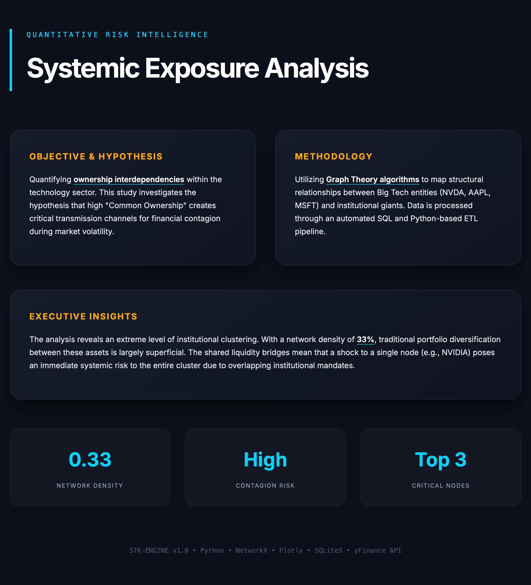

# 🛡️ Systemic Financial Risk Network Analysis

A professional-grade Python tool for quantifying institutional interdependencies and systemic risk within the technology sector. This project automates the entire pipeline: from real-time market data acquisition (yFinance) to interactive graph visualization and automated executive reporting.

## 📊 Project Preview
<p align="center">
  
  
</p>

## 🚀 Key Features
- **Automated Data Pipeline**: SQL-based storage (SQLite) for high-frequency institutional ownership data.
- **Network Theory Analysis**: Calculates market density, clustering coefficients, and identifies critical systemic nodes.
- **Stress-Test Simulation**: Models the "Domino Effect" – visualizing how a failure in one asset (e.g., NVIDIA) impacts the entire ecosystem.
- **Executive Reporting**: Generates high-end, dark-themed HTML dashboards and interactive maps for stakeholders.

## 🛠️ Tech Stack
- **Languages**: Python 3.10+
- **Data**: Pandas, NumPy, SQLite3, yFinance
- **Network Science**: NetworkX, PyVis (Interactive Physics-based Graphs)
- **Visualization**: Plotly (Executive Dashboards), HTML/CSS (Custom UI)

## 📊 Visual Insights
- **Executive Summary**: Custom-designed landing page in English.
- **Interactive Map**: Physics-based visualization of institutional bridges.
- **Risk Metrics**: Real-time contagion risk scoring.

## ⚙️ How to Run
1. Clone the repository:
   ```bash
   git clone [https://github.com/zuzamma/Financial_risk_network.git](https://github.com/zuzamma/Financial_risk_network.git)